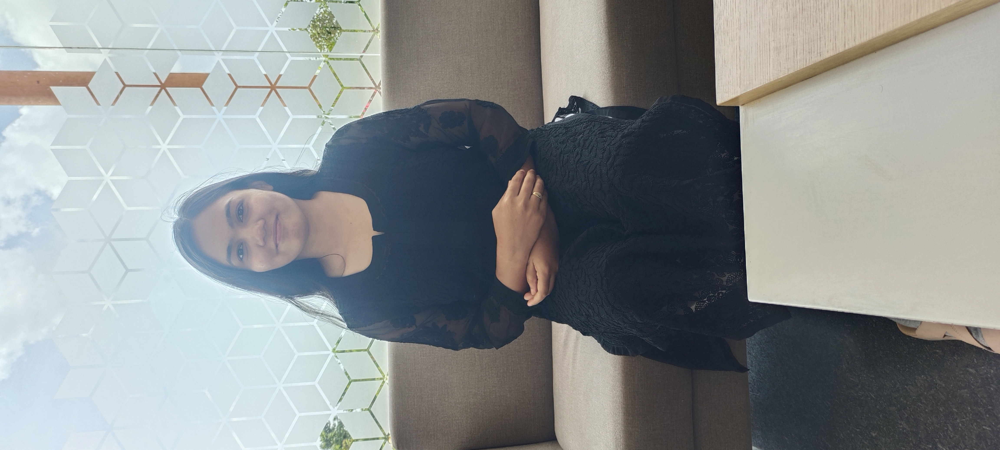

  

# Kumud Singh Porte
<!---

📧 **Email:** [kumudporte0805@gmail.com](mailto:kumudporte0805@gmail.com)  
--->
---

## **Profile Summary**

I am Kumud. I am motivated and passionate researcher in **Computer Science** with a strong foundation in  **Graph Theory**, **Automata Theory**, **Discrete Mathematics**, **Combinatorics**, **Data Structures**, **Complexity Theory**, and **Quantum Computing**.I am dedicated to advancing theoretical and applied aspects of computation through rigorous research and collaborative problem-solving. I am skilled in both teaching and research, with experience assisting undergraduate courses and contributing to peer-reviewed publications. I am reachable at kumudporte0805@gmail.com for research discussion.

---

## **Education**

- **Ph.D. in Computer Science and Engineering** — *Ongoing*  
  **Indian Institute of Technology Dharwad**  
  *Supervisor:* **Prof. R. B. Sandeep**

- **M.Tech in Computer Science and Engineering** — *2024*  
  **National Institute of Technology Raipur**  
  *Thesis:* *Multi‐Drone Path Planning*

- **B.Tech in Computer Science and Engineering** — *2021*  
  **Bhilai Institute of Technology, Durg**  
  *Project:* *Voice Based Email System*

- **Higher Secondary Education** — *2017*  
  **Mona Modern English Medium School**

- **Secondary Education** — *2015*  
  **Mona Modern English Medium School**

---

## **Research Experience**

### Teaching Assistantships

- **Parallel Programming (Spring 2024–25)** — Assisted in conducting labs, grading, and mentoring students.  
- **CS101: Introduction to Computing (Autumn 2025–26)** — Supported lectures, tutorials, and student evaluations.

---

## Publications

-   Kumud Porte, R. B. Sandeep, Kamal Santra. [Improved Upper Bounds on Color Reversal by Local Inversions.](https://arxiv.org/abs/2510.00149), 2025.

---
<!---
## **Projects**

- **Multi‐Drone Path Planning** — *M.Tech Thesis*  
  Designed and implemented algorithms for cooperative and collision-free multi-agent path planning.

- **Voice Based Email System** — *B.Tech Major Project*  
  Developed an accessible, speech-based email interface enabling voice-command communication for visually impaired users.

*GitHub links available upon request.*

---

## **Skills**

- **Programming Languages:** C, C++, Python, Java  
- **Research Areas:** Graph Theory, Automata Theory, Complexity Theory, Quantum Computing  
- **Tools and Frameworks:** LaTeX, Git, MATLAB, Linux, VS Code  
- **Soft Skills:** Technical Writing, Teaching, Team Collaboration, Problem Solving

---

--->

## Awards & Achievements

- **Qualified GATE 2024 (Computer Science)** — February 2024  
- **Qualified UGC-NET 2024 (Computer Science)** — February 2024  
- **BIT Shine Award**, College-level Idea Implementation and Presentation — August 2018

---
<!---

## **References**

**Prof. R. B. Sandeep**  
Department of Computer Science and Engineering  
Indian Institute of Technology Dharwad  
📧 *Email available upon request.*

---

© 2025 Kumud Porte. All rights reserved.

--->

